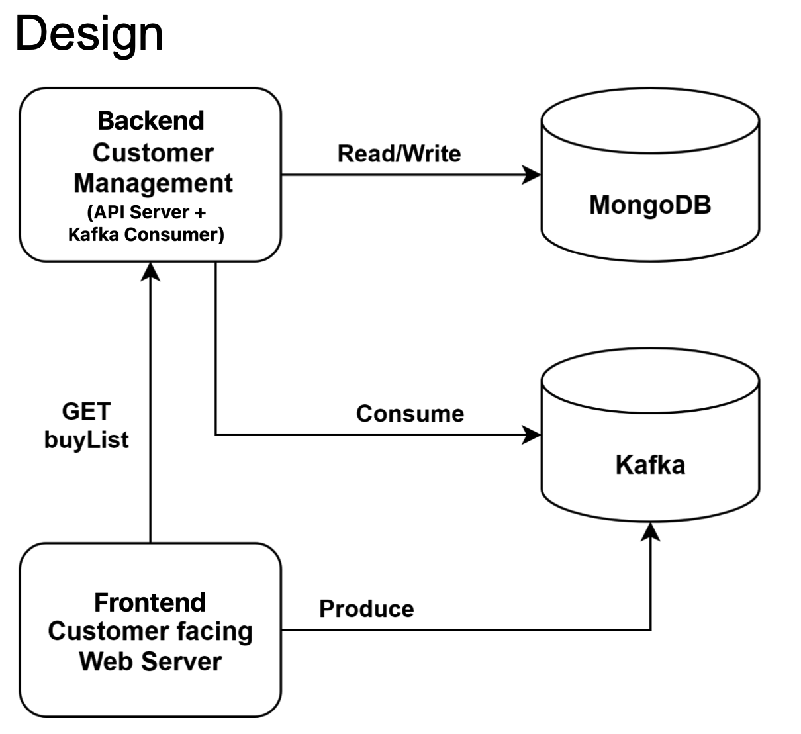

# The Minimarket

## Description

This project simulates an online market/shop, where you can "buy" and view your purchase history.   
The whole infrastructure is configured and ran via docker-compose.  
(Created by mr-anderson86, started @11/2021)

## Structure


* [The Frontend](frontend) - the frontend generates a new purchase and send the data to the Kafka.  
In addition, it can also request from the backend API for purchase history of specific user (and show the result).
* [The Kafka Consumer](backend_consumer) - part of the backed, which listens to the Kafka.  
Each time there's a new data (a new purchase) it consumes it, and sends the data into the MongoDB.
* [The Backend API Server](backend_api) - another flask application (not exposed to external network), which listens to requests from the frontend .  
Currently, handles only 1 request: get the purchase history of a specific user.  
When such request is received, it queries the MongoDB for the data, and sends the data back to the fronted.
* Frontend, Backend, Kafka and MongoDB, are all being deployed via [docker-compose](docker-compose.yml).  
  (The frontend, api server and kafka consumer are being firstly docker built, also via the docker compose)

## Usage
```bash
git clone https://github.com/mr-anderson86/minimarket.git
cd minimarket
docker-compose up -d
```

That's it, then all you need is to open your browser and go to http://localhost:9090/  
It explains there how to generate a random purchase, and also how to retrieve purchase history of a specific user.  
  
You might need to wait ~10 seconds before the frontend application is up and running.  
Or you can tail the frontend log in realtime, until you see it's running:
```bash
[youruser@yourhost]$ docker logs -f frontend
kafka_url = kafka:9092
backend_url = backend:9091
Attempting to connect to kafka...
Attempting to connect to kafka...
 * Serving Flask app 'app' (lazy loading)
 * Environment: production
   WARNING: This is a development server. Do not use it in a production deployment.
   Use a production WSGI server instead.
 * Debug mode: off
 * Running on all addresses.
   WARNING: This is a development server. Do not use it in a production deployment.
 * Running on http://192.168.192.8:9090/ (Press CTRL+C to quit)
```

To stop the minimarket, from the same directory type this command:
```bash
docker-compose down
```
The data from the DB won't be lost, since it is mounted from your host, so you'll see a new directory **mongodb** in your project's directory, 
and it contains all purchase history data.  
When you'll rerun the minimarket once again, the whole data will be mounted into the MongoDB, thus all purchase history will be there.
  
## Bonus
Also added mongo-express, so you could access the data in your mongodb via web browser.  
just go to http://localhost:8081/ (And enter the username and password mentioned in the [docker-compose.yml](docker-compose.yml) file) and there you can browse at your own will. :-)